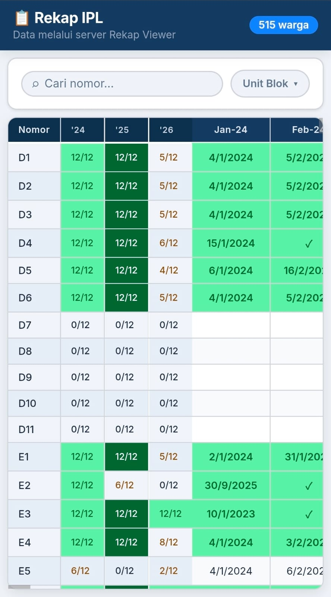

# 📋 Rekap IPL Viewer

A secure, high-performance web application to visualize IPL (Iuran Pemeliharaan Lingkungan) payment data. Now features a Node.js backend proxy that protects resident privacy by stripping sensitive information before it reaches the browser.

<details>
  <summary>📸 View UI Preview</summary>
  
</details>

## ✨ Features

- **Role-Based Privacy**: Resident names (`Nama` column) are automatically stripped on the server-side for regular residents to ensure privacy, but remain visible to authorized committee members.
- **Role-Based Access Control (RBAC)**: Enforces namespaced permission check (`rekap_viewer.read_data`) on the server to authorize views based on user roles.
- **Secure Proxy**: Uses a Node.js/Express backend to fetch Google Sheets data, keeping API keys and Spreadsheet IDs hidden from the client.
- **Ecosystem Authentication**: Integrates seamlessly with the Veryresto community platform, sharing session state via JWT cookies and providing a unified global sign-out experience.
- **Dynamic Profile Dropdown**: Displays the active user's details and roles dynamically via a tag-based system in the navigation dropdown.
- **Sticky UI Layout**: 
  - Sticky table headers (top-frozen).
  - Sticky identity columns (Blok, Nomor) and Year Summary columns (frozen on horizontal scroll).
- **Interactive Multi-Select Filters**: Filter payment status (e.g., "Lunas") per year with multi-select support, alongside mobile-optimized collapsible filter bars.
- **Visual Analytics**: Instant calculation of yearly payment status with color-coded highlighting.

---

## Live Demo

- **Fly Domain**: [rekap-viewer.fly.dev](https://rekap-viewer.fly.dev/)
- **Custom Domain**: [rekap.veryresto.com](https://rekap.veryresto.com/)

---

## 🏗️ Architecture Evolution

This project serves as a hands-on exploration of **Fly.io** and operational best practices. It evolved from a simple static site into a cached backend architecture to address practical challenges like credential security, request latency, and state-sharing in distributed environments.

### Phase 1: Static Frontend (The Beginning)
*   **Architecture**: `Browser → Google Sheets API`
*   **Status**: Legacy (Proof of Concept)
*   **Description**: Originally a static frontend hosted on Netlify. While functional, it exposed the Spreadsheet ID and Google API Key in the client-side code. Performance was directly coupled to Google Sheets API latency.
*   **Branch**: [`main`](https://github.com/veryresto/rekap-viewer/tree/main)

### Phase 2: Secure Proxy (Node.js + Fly.io)
*   **Architecture**: `Browser → Fly Backend → Google Sheets API`
*   **Status**: Intermediate
*   **Description**: Migrated to a Node.js backend on Fly.io. This allowed for secure secrets management (API keys hidden), custom domains, and better observability. I used this phase to gain operational experience with Fly Machines, request tracing, and failure scenario testing.
*   **Branch**: [`fly-backend`](https://github.com/veryresto/rekap-viewer/tree/fly-backend)

### Phase 3: Adding Caching Layer (Current)
*   **Architecture**: `Browser → Fly Backend → Tigris Object Storage`
*   **Status**: **Current**
*   **Description**: Introduced a caching layer using **Tigris Object Storage** with a background refresh every 5 minutes. This decoupled user requests from Google Sheets latency, significantly reducing TTFB. Tigris was chosen over local storage to ensure a shared cache state across future multi-region deployments.
*   **Branch**: [`fly-object-storage`](https://github.com/veryresto/rekap-viewer/tree/fly-object-storage)

### 📊 Performance Insights & Benchmarking

To validate the architecture, I benchmarked the app from multiple locations using `curl` timing metrics.

*   **Key Finding**: Requests entering via Fly's London edge were noticeably faster than requests from a standard London VM over the public internet.
*   **Tools**: [benchmark.sh](helpers/benchmark.sh)
*   **Results**:
    - [Singapore Benchmark Log](helpers/benchmark_ubuntu-singapore_20260514_141302.log)
    - [London Benchmark Log](helpers/benchmark_ubuntu-benchmark-london_20260514_135825.log)

---

## 🛠️ Local Setup

1. **Clone the repository**:
   ```bash
   git clone https://github.com/your-username/rekap-viewer.git
   cd rekap-viewer
   ```

2. **Install Dependencies**:
   ```bash
   npm install
   ```

3. **Configure Environment**:
   - Create a `.env` file in the root directory:
     ```env
     GOOGLE_API_KEY=your_google_api_key
     SHEET_ID=your_spreadsheet_id
     SUPABASE_URL=your_supabase_url
     SUPABASE_ANON_KEY=your_supabase_anon_key
     PORTAL_URL=http://community.localtest.me:5137
     PORT=3000
     ```

4. **Run Locally**:
   ```bash
   npm start
   ```
   Open [http://localhost:3000](http://localhost:3000) in your browser.

---

## 🚀 Deployment (Fly.io)

This project is optimized for deployment on **Fly.io** using Docker.

### 1. Launch App
```bash
fly launch
```

### 2. Set Secrets
Ensure your sensitive credentials are set as Fly secrets:
```bash
fly secrets set GOOGLE_API_KEY=AIza... SHEET_ID=1xWE...
```

### 3. Deploy
```bash
fly deploy
```

---

## 📊 Google Sheets Requirements

The application expects a specific sheet structure, though it filters data for privacy:

1. **Permissions**: The sheet must be shared as **"Anyone with the link → Viewer"**.
2. **Sheet Tab Name**: The default tab name should be `Import` (configurable via `RANGE` env var).
3. **Structure (Original Sheet)**: 
   - **Column A**: RT (Ignored by app)
   - **Column B**: Blok (Sticky)
   - **Column C**: Nama (**STRICTLY STRIPPED** by server for privacy)
   - **Column D**: Nomor (Sticky)
   - **Subsequent columns**: Monthly payment data (e.g., Jan-24, Feb-24...)

## 📄 License
MIT
